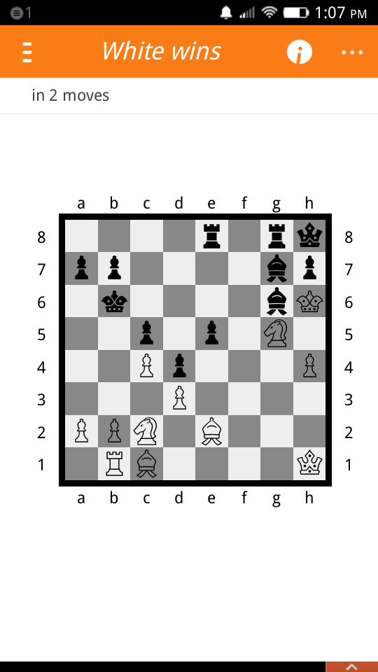
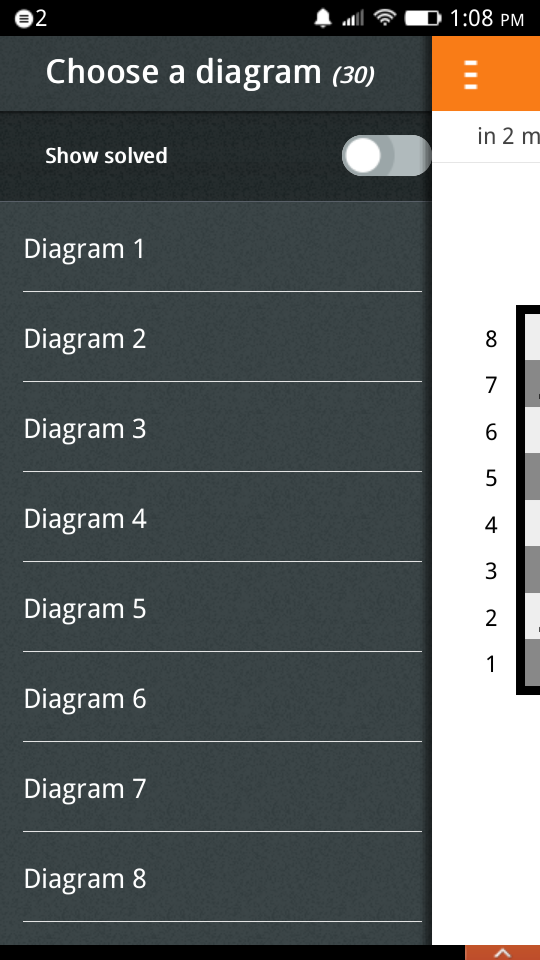
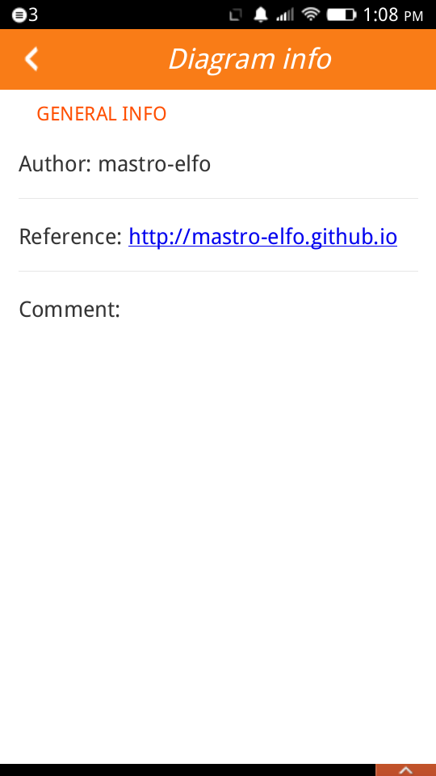
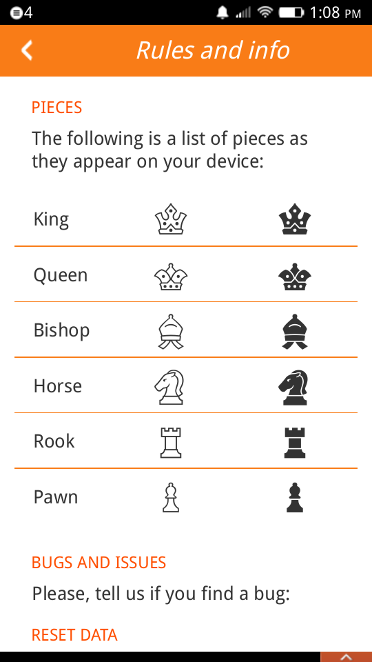

White Wins (in 2 moves)
=======================

**WhiteWins** is a collection of chess diagrams.

The aim of the game is to give checkmate to Black in 2 moves.

The solution of each diagram is to find the first of these 2 moves, that is a move which, for any response of the Black, the White can always give checkmate.

When you've chosen the move select the piece with a click and then select, always with a single click, the house of your intended move. Below you will see the result.

If the answer is incorrect you may see a hint of a possible move for the Black (highlighted in red) that avoids checkmate.

If the answer is correct click on "Next" to solve another diagram.

The list of diagrams is in the side panel on the left: from here you can choose another diagram to solve.

Screenshots
===========

